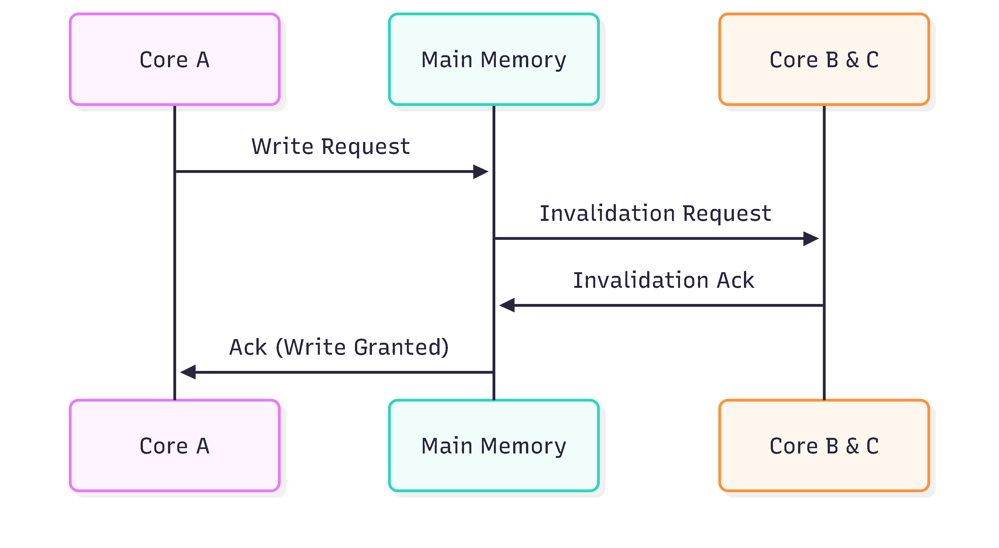

# Coherence

To understand cache coherence, we need to first define what coherence is, a simple real world scenario before delving into cache coherence

## What is Coherence

Coherence can be defined as being logically consistent. In software, coherence guarantees that when multiple actors read/write to some shared state, they always agree on a shared linear order of writes. Simply put, coherence ensures no write by any actor is lost.

#### A Simple Real World Scenario

Ada is a student of a university, she downloads her department's current timetable to her phone. At 10:30AM every Monday, Ada has a DSA class in Room 2 of her department building. However, last night, her course coordinator, decides he wants to move the DSA class from 10:30AM to 1:30PM. He relays this change to the IT team to update the timetable on the university portal, however, before the IT team gives him a response, he tells the students to redownload their timetable from the university portal. However, the IT team hadn't updated the timetable yet. Ada as the diligent student she is, redownloads the timetable only to find no changes. The next Monday, Ada pulls up 10:30AM prompt to her DSA class only to find no class being held there. Now Ada's local timetable is incoherent with the actual timetable since her linear ordering of writes to the time table doesn't reflect the linear ordering of writes by her course coordinator.

## What is a Cache?

A cache, generally, can refer to a location which data is held for fast access to certain data. Caches are used to hold data locally temporarily for quick access, usually when fetching data from a global location is slower.

As a baseline system model for a sample multicore chip, each core contains its own private data cache which is usually a _writeback_ cache and a shared LLC(Last Level Cache) located near the main memory. In a _writeback_ cache, data is written to the cache only and not propagated to main memory until the cache is evicted/flushed.

### The Problem of Coherence

The problem of coherence arises when multiple actors (cores) act upon some shared state (main memory) without proper synchronization. This creates a race condition where writes from one actor might not be visible to other actors.

For example, given two cores A and B who are executing a program. To denote writes to a memory location we use the symbol `S` and to denote reads from a memory location we use the symbol `L`.

| Core A         | Core B       |
| -------------- | ------------ |
| S1: flag = SET | L1: x = flag |
|                | if x != SET  |
|                | GOTO L1      |

Recall from our base line system model, a core contains its own private data cache (which is usually _writeback_)
and a _writeback_ cache does not propagate writes to main memory until the cache is evicted/flushed. This introduces a problem for core B, since core A's write might not be propagated to main memory, core B might never see core A's write, hence looping forever. However this is issue is solved using **coherence protocols**

## Coherence Protocols

Informally, coherence protocols ensure writes from one core are made visible to other cores. Coherence protocols implemented in most multicore chips can be divided into two subcategories:

1. Consistency Agnostic Coherence: These protocols propagate writes synchronously to all cores, meaning they ensure writes are visible before they return. This basically give an abstraction of an atomic memory system. They also aren't dependent on the memory consistency model to ensure the visibility of writes to other cores
2. Consistency Directed Coherence: These protocols propage writes asynchronously to all cores, meaning a they do not wait for writes to be visible to other cores before returning, allowing for stale values to be read. To enforce consistency, the order in which writes are made visible to other cores is governed by the memory consistency model of the system.

However, for this writeup, I will only be focusing on **Consitency Agnostic Coherence**

## Consistency Agnostic Coherence

To define consistency agnostic coherence protocols more formally, we define them in terms of invaraints. These protocols are upheld by two invariants which exist to ensure correctness.

1. **Single Writer, Multiple Readers (SWMR) Invariant**: This states that for a given memory location X, at any time, there should only be a single core writing to (or reading) X or multiple cores reading from X but none writing to it. This invariant goes further and implies that the lifecycle of a memory location can be divided two epochs. A RW (Read/Write) Epoch and a RO (Read Only) Epoch.

- A RW epoch begins when a core writes to a memory location and ends at the beginning of a RW or RO epoch from a seperate core
- A RO epoch begins when a core reads from a memory location and ends at the beginning of a RW epoch from that core or a seperate core

2. **Data Value Invariant**: This invariant builds upon the epoch based approach of the SMWR Invariant, stating that the value of a given memory location at the end of the most recent RW epoch, must be the same as the value of that memory location at the beginning of a new RO or RW epoch.

### Maintaining these invariants

To maintain these invariants:

1. If a core reads from a memory location, a `message` is sent to other cores to re-read their values from that memory location. It also ends the current epoch if it's a read/write epoch

2. If a core writes to a memory location, a `message` is sent to other cores to re-read their values from that memory location. It also ends the current epoch if it's a read/write or a read only epoch

## Granularity of Cache Coherence

Cache coherence is usually performed at a granularity of the cache block level, which is usually 64 bytes, meaning the invariants apply not specifically to individual memory locations but to cache blocks. If multiple memory locations are present on a cache block, the invariants are upheld on that cache block rather than on each individual memory location. This level of granularity introduces a new issue called **Cache Bouncing**. I will go into detail more about false sharing which is related to cache bouncing in my next writeup.
