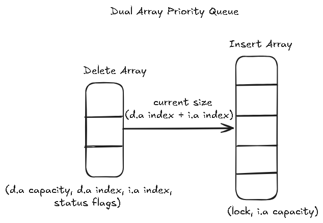
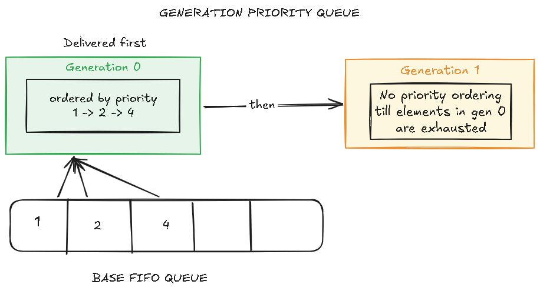

## Turning a Concurrent FIFO Queue Into a Bounded Priority Queue

A while back, I decided to take on the task of building a bounded concurrent priority queue. I decided a good place to start would be existing literature on concurrent priority queues. To my surprise, a lot of the literature I found was mainly focused on unbounded priority queues. Instead of dropping the project, I decided to improvise and design a bounded priority queue using the papers I had read as my foundation.

### Goals

To prevent this from turning into a multi-month long journey, I decided to explicitly lay down my goals early on:

- Primary operations are `add`, `poll/delete-min`
- Underlying structure must be an array, as its easier to maintain boundedness with it, this easily disqualified skip-list or linked list based approaches
- Low latency delete min operations for a 50/50 add/poll workload mainly optimizing for the 99th percentile. I'll be using a lock bounded priority queue as my baseline for this

### Enforcing boundedness

When enforcing boundedness, one of my major goals was to do so while decoupling producer and consumer operations. The reason for this was to avoid a single serialization point producer and consumer threads,
which in turn could become a bottleneck later down the line.

This ruled out any concurrency control technique in which all threads had to come to consensus on the size of the queue through a shared counter. For example, per node fine-grained locking or segmentation, where both insert and delete operations need a serialized view of the size of the queue before proceeding.

Eventually I landed on what I believed was a simple way to enforce boundedness. It had a major flaw I didn't realize at the moment, though.

### Dual arrays

My initial design involved a dual array structure consisting of an insert array and delete array.

The insert array is a single fixed capacity array. In itself, the insert array actually coordinates very little work simply allowing threads to claim an index and insert values in the array.

However, the delete array is an immutable & growable (up to a bound) array which coordinates delete operations and allows deleting threads to proceed without interfering with insert threads (up till a merge operation). 

It uses `CAS` or `FAA` semantics to allow threads to claim indices in the delete array before actual deletion.

In the case of the delete array being empty, when the delete index >= delete array capacity, a merge is required.

A merge is essentially a stop the world operation, for both insert and delete threads, which is serialized through a single thread. A merge sorts the whole insert array for FIFO based arrays and then drains the N highest priority values from the insert array into a new delete array. A merge can also be triggered in the scenario that an element with a higher priority than the lowest priority element in the delete array is to be inserted into the insert array.

Boundedness is preserved by summing the count of the current values in the insert array and the remaining values in the delete array before any operation is performed.

This design had a major flaw that contradicted my initial goals

Merge operations are a serialization point for both insert and delete operations. Since the sort in merge operations are unbounded, the duration for a sort scales with the size of the array; meaning if the array is pretty large, a "slow" thread, in practice could stall other threads for an indefinite amount of time with the upper bound being the actual capacity of the array which could cause unpredictable tail latencies under contention.

This problem gets worse under bursty high priority insert traffic, where each such insert could trigger another merge before the previous one's cost has even been amortized.

To tackle the problem of unbounded sorts, I decided to move some complexity to the insert side by ensuring inserts maintain priority order, through a serialized sequential priority queue, removing the need for unbounded sorting during merges. 
To make merge occurrences predictable, I removed the logic that triggered a merge whenever an incoming element had greater priority than the lowest priority item in the delete array.

By ensuring inserts maintain priority ordering, merges are considerably shorter as all that is required is to remove the top N priority elements from the serialized sequential priority queue, however a "slow" thread could still stall other threads for a substantial amount of time.

### A simpler redesign

Even with a bounded sort, a slow thread could still stall every other thread during a merge; the dual array approach wasn't cutting it. This redesign's goal was to decouple merge entirely from the insert path, while still amortizing its cost on the delete path.

To solve this, I settled on a design that repurposes a well studied data structure: A concurrent FIFO Queue.

Simply put, to convert a FIFO queue into a concurrent priority queue, I relaxed certain invariants in the priority queue, most notably, the fact that the whole queue has to be ordered.
Instead of enforcing global ordering, we bound priority ordering to contiguous segments called `generations`. 
Elements in earlier generations are guaranteed to have arrived before elements in subsequent ones, leveraging FIFO semantics. 

Since elements arrive in FIFO order, we need some way to ensure priority ordering, in a generation. This is achieved during a segment/generation sort. This sort operation is similar to merge operations in the dual array queues, however these sorts are completely decoupled from inserts and don't stall concurrent inserts, however, deletes are stalled during this sort. To address the issue of a "slow" thread performing a segment sort, the number of elements being sorted are bound to the range of the generation to ensure the time taken to perform this sort doesn't scale with the capacity of the array.

A new generation begins once a previous generation has been sorted OR the range of a generation has exceeded a given segment limit. Also, generations are logical, in the sense that there is no actual physical mechanism to track generations rather they are used to ensure the **priority** semantics of the queue

To guard against false sharing, I added manual cache line padding to the generational queues, separating fields that are updated independently by different threads (e.g. producer/consumer indices, sort buffers, status flags etc.) onto their own cache lines. I didn't bother with this in the dual-array structures tbh. The cost of this however, is a larger memory footprint, which might not be suitable depending on a system's constraints.

## Benchmarks

To make things more concrete, I prepared a micro benchmark using JMH. This benchmark compares 4 priority queues I cooked up. 
Two from the dual array family: `LBPQ and OBQ` and two from the generation priority queue family: `PADDED-GEN and MPMC-GEN`. 
These are benchmarked against a serialized fixed capacity sequential priority queue (JDK's implementaion) baseline `LOCK`.

- JMH version: 1.37
- Warmup: 10 iterations, 1 s each
- Measurement: 10 iterations, 1 s each
- Timeout: 10 min per iteration
- Threads: 8 threads (1 group; 4x "deleteMin_4_4", 4x "insert_4_4" in each group)
- Benchmark mode: Sampling time
- Forks: 3
- Thread configuration: 8
- CPU Specs: Intel(R) Core(TM) i5-10300H CPU @ 2.50GHz (2.50 GHz), 4 cores, 8 processors

#### Baseline vs. Generational Performance
All priority queues use a fixed capacity of 65536. The generational priority queues use a segment limit of 1024 in this benchmark while the dual array family uses a 655 delete array capacity in these benchmarks.

From the chart, we can see the generational designs accomplish my core goals, for p99 latencies at the cost of an extreme tail, though moderate compared to LOCK and LBPQ.

OBQ is the only design that drifts upward earlier however, its curve remains much flatter, and it actually achieves the lowest max tail latency compared to the other designs
at about ~6000 us/op. I decided to re-run the benchmarks specifically for OBQ, just to ensure this wasn't a one time occurrence, but it's actually not. 

This is mainly because OBQ continuously maintains priority order on the insertion path, its delete-min operation never pays a cost to ensure priority order.

LBPQ and LOCK experience severe tail latency spikes, soaring to nearly ~40000 us/op at p1.00; the worst of the designs. 

#### Impact of Segment Limit on Tail Latency
This benchmark aims to isolate how segment size directly drives sorting overhead in generational queues

Smaller segment limits (128–512) trigger sorts more frequently, but because each individual sort operates on a small segment limit, execution cost per operation is pretty cheap. 

This keeps latency virtually flat through p99.9, only spiking at extreme tail percentiles (p99.99) where worst case contention hits and even then, peaking at under 700 us/op.

Conversely, larger segment limits reduce sort frequency at the expense of much heavier individual sorting operations. 

This pushes tail latency out much earlier as 2048 begins degrading right at p99, climbing near-linearly to ~1000us/op at p99.99.

4096 however suffers a lot, spiking aggressively past p99 and reaching nearly 1800us at p99.99, more than 2.5times the worst case latency of the 128 limit.

*(Note: p1.00 was excluded from this chart as values converged across all segment limits.)*

## Final Thoughts
The generational redesign achieved my core goals.

That said, there's still room for improvement; maybe I missed something, or there's a better way of doing something I already did.

The dual array priority queues are inspired by the CBPQ paper. The base queue for my generational priority queue is inspired by the MPSC and MPMC FIFO queues from JCTools. All implementations were stress tested with JCStress.

Source code and prior notes are available on my GitHub repo: https://github.com/kusoroadeolu/cleap

## Papers & References I found useful
- [CBPQ](https://csaws.cs.technion.ac.il/~erez/Papers/cbpq-europar2016.pdf)
- [PIPQ](https://arxiv.org/pdf/2508.16023)
- [Hunt et al](https://www.cs.rochester.edu/u/scott/papers/1996_IPL_heaps.pdf)
- [Multi Queue](https://dl.acm.org/doi/full/10.1145/3771738)
- [JCtools](https://github.com/JCTools/)
- [Memory Bounds](https://arxiv.org/pdf/2104.15003)

Something I'm also curious about is how much you can realistically relax the invariants of a structure before it is incorrect or basically another structure.
I wonder if there's a some research on that